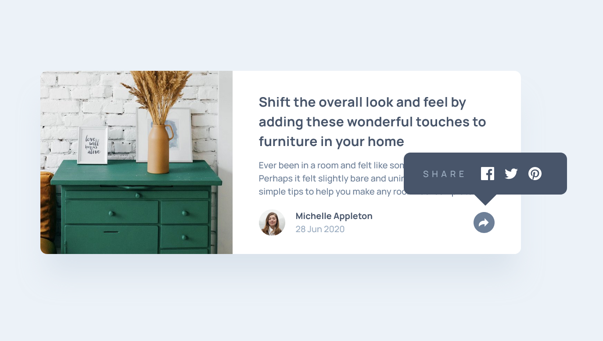

# Frontend Mentor - Article preview component solution

This is a solution to the [Article preview component challenge on Frontend Mentor](https://www.frontendmentor.io/challenges/article-preview-component-dYBN_pYFT). Frontend Mentor challenges help you improve your coding skills by building realistic projects. 

## Table of contents

- [Overview](#overview)
  - [The challenge](#the-challenge)
  - [Screenshot](#screenshot)
  - [Links](#links)
- [My process](#my-process)
  - [Built with](#built-with)
  - [What I learned](#what-i-learned)
- [Author](#author)

## Overview

### The challenge

Users should be able to:

- View the optimal layout for the component depending on their device's screen size
- See the social media share links when they click the share icon

### Screenshot




### Links

- Solution URL: [Frontend Mentor Solution](https://your-solution-url.com)
- Live Site URL: [Vercel-hosted demo site](https://article-preview-component-five-murex.vercel.app/)

## My process

### Built with

- Semantic HTML5 markup
- CSS custom properties
- Flexbox
- CSS Grid
- Mobile-first workflow


### What I learned

I'm getting more comfortable using pseudo elements in my projects to achieve all sorts of tricky layouts and components. For example, I used this bit of code to achieve the down arrow that hangs off the social sharing menu (active state) for desktop layouts:

```css
  .card-share::after {
    content: "";
    position: absolute;
    width: 24px;
    height: 24px;
    bottom: -12px;
    left: 112px;
    background: var(--clr-dark-blue-primary);
    /* make this 24x24 square a triangle: */
    transform: rotate(-45deg); 
  }
```

## Author

- Website - [Matt Pahuta](https://www.mattpahuta.com)
- Frontend Mentor - [@MattPahuta](https://www.frontendmentor.io/profile/MatPahuta)
- Twitter - [@MattPahuta](https://www.twitter.com/MattPahuta)